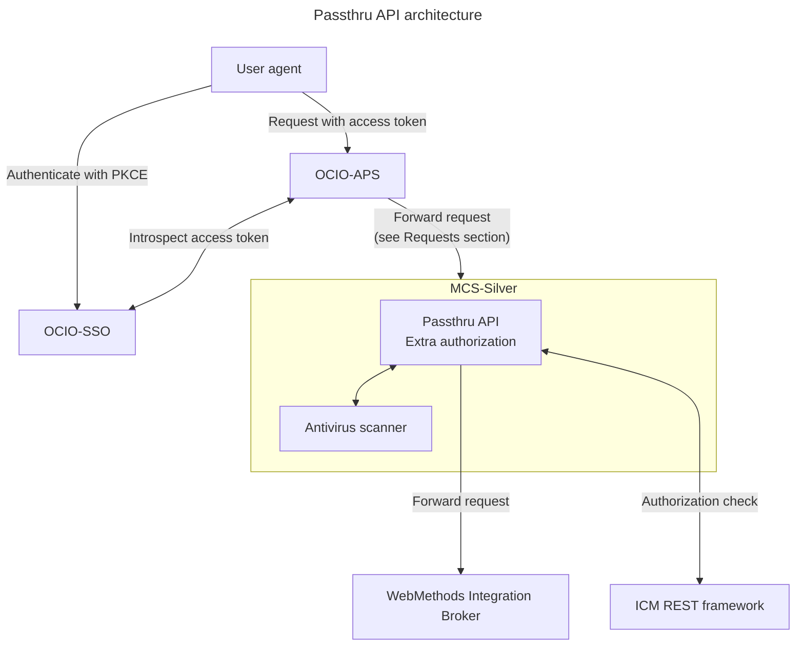

## Requests

Forwarded requests:

| INT | Description |
|-|-|
| 620b | Get caseload |
| 621b | Get entity details |
| 622 | Submit safety assessment |
| 678 | Get notes |
| 679C | Submit notes |
| 680 | Submit attachment |

## Additional information:

- [ICM REST framework](https://dev.azure.com/bc-icm/SiebelCRM%20Lab/_wiki/wikis/SiebelCRM-Lab.wiki/575/Siebel-Application-Client-ID-(Service-Account)-Operation-for-DATA-API)
