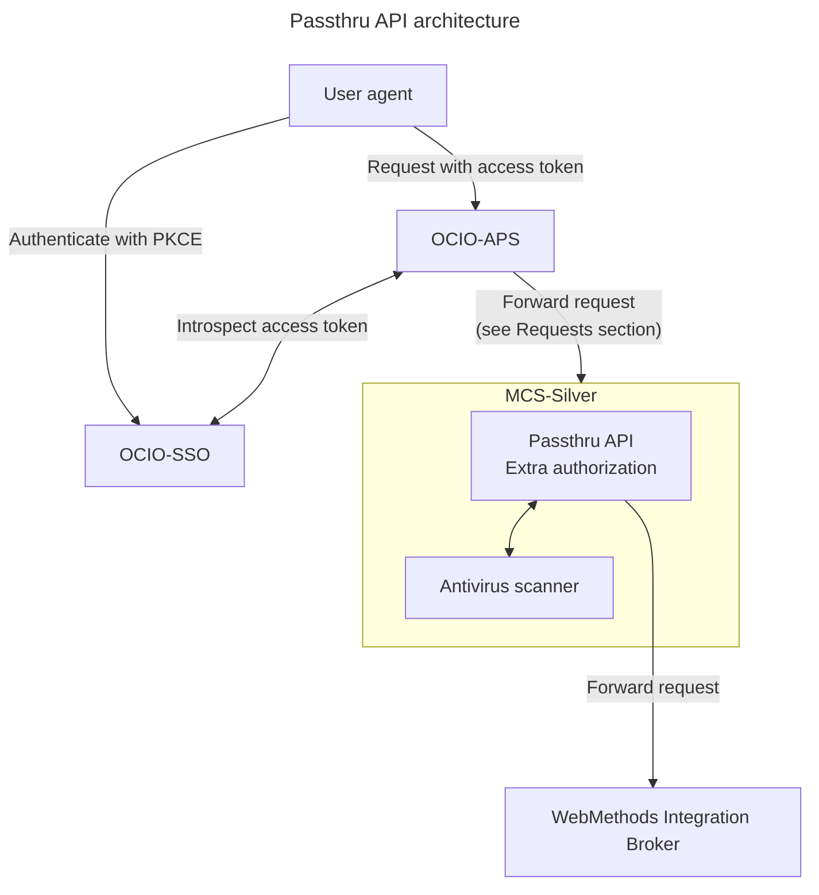

## Requests

Forwarded requests:

| INT | Description |
|-|-|
| 620b | Get caseload |
| 621b | Get entity details |
| 622 | Submit safety assessment |
| 678 | Get notes |
| 679c | Submit notes |
| 680 | Submit attachment |
