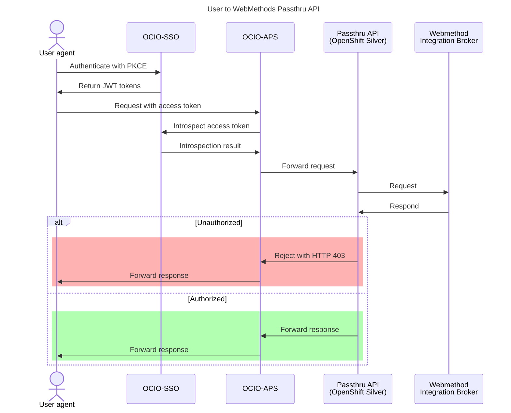

```mermaid
---
title: User to WebMethods Passthru API
---
sequenceDiagram
  actor User as User agent
  participant Keycloak as OCIO-SSO
  participant Kong as OCIO-APS
  participant Api as Passthru API<br/>(OpenShift Silver)
  participant Up as Webmethod<br/> Integration Broker

  User->>Keycloak : Authenticate with PKCE
  Keycloak ->>User: Return JWT tokens

  User->>Kong : Request with access token
  Kong ->>Keycloak : Introspect access token
  Keycloak ->>Kong : Introspection result

  Kong ->>Api: Forward request

  Api->>Up: Request
  Up->>Api: Respond

  alt Unauthorized
    rect rgba(255, 0, 0, 0.3)
      Api->>Kong : Reject with HTTP 403
      Kong ->>User: Forward response
    end

  else Authorized
    rect rgba(0, 255, 0, 0.3)
      Api->>Kong : Forward response
      Kong ->>User: Forward response
    end
  end
```
